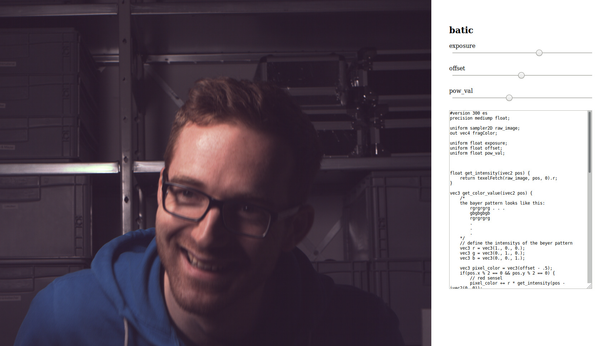

# batic
play with debayering algorithms using webgl and glsl.

## [try it!](https://anuejn.github.io/batic)
*BATIC* is a [shadertoy](https://shadertoy.com) inspired tool for experimenting with debayering and raw development algorithms.
You can develop debayering code in glsl see the impact of your changes live.

Sliders for `uniform floats` are added automatically, so you can experiment with different parameters. The sliders have a range
from `0.0` to `1.0` and are initially set to `0.5`;

The raw sensel data is in the texture `raw_image` and can be accessed in the same way, the example does it.
To get started with the glsl language, i recommend to read [this section](https://webgl2fundamentals.org/webgl/lessons/webgl-shaders-and-glsl.html#glsl).
And reading the example debayering code.

The demo image is provided by the apertus project and taken on the AXIOM Beta.

